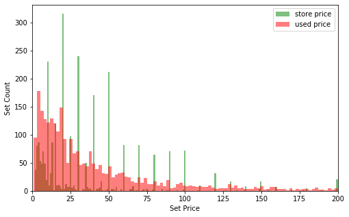

# Regression for Pricing of LEGO Sets

The goal of this project is to predict the store price of new LEGO sets. That is, based on properties of the set (number of pieces, colors, themes, etc), we will predict the price at which the company will release the set. 

This project was created under the FlatIron School's Data Science Bootcamp, for the Module 4 project.

[Non-Technical Presentation (Google Slides)](https://docs.google.com/presentation/d/1h-8MnhFCwu_dVXVftjegIf_1CB65Z5tXdPTkiSW0yjo/edit?usp=sharing)

## Project Roadmap

**Contributors:** Phillip Busko & Sorin Luca

**Data Sources**
- [brickset.com](https://brickset.com)
- [kaggle.com](https://www.kaggle.com/rtatman/lego-database)

**Tasks**
- Scrape and clean data from brickset website *(PB)*
- Join kaggle data and run feature engineering *(SL)*
- Run linear regression for store price *(PB)*
- Run support vector regression for store price *(SL)*

## Results

Both the linear regression and SVR (with linear kernel) models were able to fit the launch price with a R2 of about 0.86. The SVR with an RBF kernel was slightly better with a R2 of about 0.89.

The number of total parts and the number of different parts are the most important independent variables for this problem.

## Methodology

**1. Scrape Brickset:** Data was scraped using the requests and beautifulsoup libraries. Since there are thousands of sets available, the work was broken down by first getting the url of each set for each year. Then each url is visited, and it's data is scraped. The data fields available from this are: set-id, name, year, themes, minifig count, store price, used price, user rating, and set type.

**2. Feature Engineering:** The kaggle data was joined with the basic data for additional features. Some of these features are readily availabe, while others were manufactured based on some guesses as to what factors might be contributing to establishing the store price. 
Also at this point some filtering was done on the sets, so that LEGO non-sets, such as clothing items, are removed from our data. The new data fields are: total number of pieces, number of different pieces, primary color, secondary color, and number of different colors. 

